<div align="">

```
    __  __              ____             _   ___      __      __         _       __  
   / / / /__  __  __   /  _/___ ___     / | / (_)____/ /__   / /   ___  (_)___ _/ /_ 
  / /_/ / _ \/ / / /   / // __ `__ \   /  |/ / / ___/ //_/  / /   / _ \/ / __ `/ __ \
 / __  /  __/ /_/ /  _/ // / / / / /  / /|  / / /__/ ,<    / /___/  __/ / /_/ / / / /
/_/ /_/\___/\__, /  /___/_/ /_/ /_/  /_/ |_/_/\___/_/|_|  /_____/\___/_/\__, /_/ /_/ 
           /____/                                                      /____/        
```

I am computer science student at **Arizona State University**, I'm interested in **Cloud** and **AI/ML**. When I am not messing with my config files and dealing with wayland errors I am usally grinding LeetCode, learning more about AWS, and exploring neural networks! 

If you'd like to learn more about me please take a look at my linkedin and personal website. Reach out and connect!
<br/>

[](https://www.linkedin.com/in/-nicholas-leigh)
[](mailto:nickleigh05@gmail.com)
[](https://nickleigh05.github.io/nicksnexus/)

---

<br/>

In your terminal run:



### 🗂️ Projects

1. [cloud-collar](https://github.com/nickleigh05/cloud-collar) — Privacy-first edge presence analytics with local YOLOv8 + re-ID inference and serverless AWS backend
2. [MMA-Machine](https://github.com/nickleigh05/MMA-Machine) — PPO RL MMA simulation with self-play league and 1,000-fighter morphology system
3. [NNFS](https://github.com/nickleigh05/NNFS) — Neural network from scratch in Python
4. [nicksnexus](https://nickleigh05.github.io/nicksnexus/) — Personal site built with TypeScript

---
